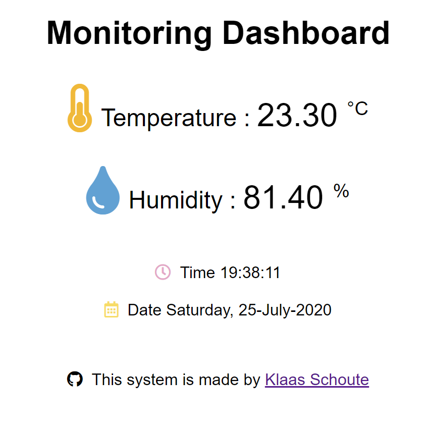

## Sensortastic! ✨

<p>
  
  
</p>

![Project Stage][project-stage-shield] ![Maintain Stage][maintain-stage-shield] [![Github License][license-shield]][license]

[![GitHub Last Commit][last-commit-shield]][commits] [![Github open issues][open-issues-shield]][issues] ![View Counter][view-counter-shield]

With this project it's possible to collect temperature and humidity data using an esp8266 and save it to an InfluxDB database. To make a nice dashboard overview in Grafana afterwards. It's also possible to access a web interface via the IP address, so that you can always view the values in a simple way (as seen in the screenshot below).

<p align="center">
    
</p>

If you have suggestions or questions, open an [issue][issues] or contribute via a [pull request][pr]!

## 🧰 What do you need?

- ESP8266
- DHT22 sensor (you can also use other types)
- USB power :smile:
- Docker :whale:

### Schematic

| DHT22 | NodeMCU / ESP8266 |
| --- | --- |
| DAT | D1 (GPIO5) |
| VCC | VCC (3V3) |
| GND | GND |

If interested, I plan to design a circuit board for this project in the future.

## How to setup

- You need Arduino IDE to configure some files, and use the serial monitor (other IDE's are okey).
- You need the `ESP8266WebServer`,`Scheduler` and `InfluxDbClient` libraries.

Further down this page you will find all information about which adjustments you have to make.

## Credentials

### Software

Before we can run Grafana and InfluxDB, there are a few values that we have to add in the yaml files for docker swarm / docker-compose.

#### Docker-compose

If you use the docker-compose option, adjust the `.env` file:

```bash
INFLUXDB_NAME=sensortastic
INFLUXDB_USERNAME=thebigboss
INFLUXDB_PASSWORD=sexypassword

GRAFANA_USERNAME=admin
GRAFANA_PASSWORD=admin
```

After this you can run it with `docker-compose up -d`

#### Docker stack (swarm)

If you use the docker stack deploy (swarm) option, adjust the `sensortastic.yml` file:

```yaml
# InfluxDB
environment:
  INFLUXDB_DB: sensortastic
  INFLUXDB_HTTP_AUTH_ENABLED: 'true'
  INFLUXDB_ADMIN_USER: thebigboss
  INFLUXDB_ADMIN_PASSWORD: sexypassword

# Grafana
environment:
  GF_SECURITY_ADMIN_USER: admin
  GF_SECURITY_ADMIN_PASSWORD: admin
```

You can deploy it with `docker stack deploy -c sensortastic.yml sensortastic`

#### Grafana

For Grafana we create the data source of influxdb in advance, for this you only need to add the database name and username / password to the `dataresource.yml` file. You can also skip this step and add your data source via the UI later.

```yaml
datasources:
  - name: InfluxDB
    type: influxdb
    access: proxy
    database:
    user: 
    password:
    url: http://influxdb:8086
    isDefault: true
    editable: true
```

---

### Hardware - Arduino

Within the arduino project folder ([sensortastic](./Sensortastic)) there is a `config.h`, which contains all the necessary variables that the maincode needs to run properly.

```C++
// Basic Information
#define LOCATION        "Bathroom"

// Wi-Fi credentials
#define WIFI_SSID       "wifi6"
#define WIFI_PASSWORD   "ddoswillwork"

// InfluxDB
#define INFLUXDB_URL          "http://IP_TO_SERVER:8086"
#define INFLUXDB_MEASUREMENT  "example"
#define INFLUXDB_DB_NAME      "sensortastic"
#define INFLUXDB_USER         "thebigboss"
#define INFLUXDB_PASSWORD     "sexypassword"

// Settings
const bool uploadLedPulse = true;
const float waitTime = 60 * 60 * 1000;       // 1 hour
```

If you set the **uploadLedPulse** to `true`, the ESP8266 will flash its LED every time the data upload to InfluxDB was successful, if you prefer that the LED does not pulse then set the value to `false`. **waitTime** determines how long to wait until new data is saved again.

## Troubleshooting

If you get an error, create then an [issue][issues] so that I can sort things out for you.

[issues]: https://github.com/klaasnicolaas/Project-Sensortastic/issues
[pr]: https://github.com/klaasnicolaas/Project-Sensortastic/pulls
[commits]: https://github.com/klaasnicolaas/Project-Sensortastic/commits/master
[license]: https://github.com/klaasnicolaas/Project-Sensortastic/blob/master/LICENSE


[last-commit-shield]: https://img.shields.io/github/last-commit/klaasnicolaas/Project-Sensortastic
[open-issues-shield]: https://img.shields.io/github/issues-raw/klaasnicolaas/Project-Sensortastic
[license-shield]: https://img.shields.io/github/license/klaasnicolaas/Project-Sensortastic
[view-counter-shield]: https://img.shields.io/github/search/klaasnicolaas/Project-Sensortastic/view
[project-stage-shield]: https://img.shields.io/badge/project%20stage-production%20ready-brightgreen
[maintain-stage-shield]: https://img.shields.io/badge/maintained-yes-brightgreen